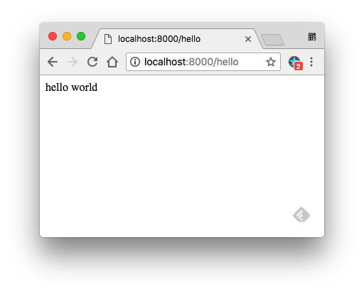

JavaScript HapiJS Server Demo
=============================

使用[HapiJS](https://hapijs.com/)来创建一个NodeJS server.

至于为什么我们要使用HapiJS而不使用Express，将在另一个Demo中说明(TODO)。

```
npm install
npm run demo
```

It will start the server:

```
Server running at: http://localhost:8000
```

And client can access: <http://localhost:8000/hello> with `GET` to get the answer:

```
hello world
```

